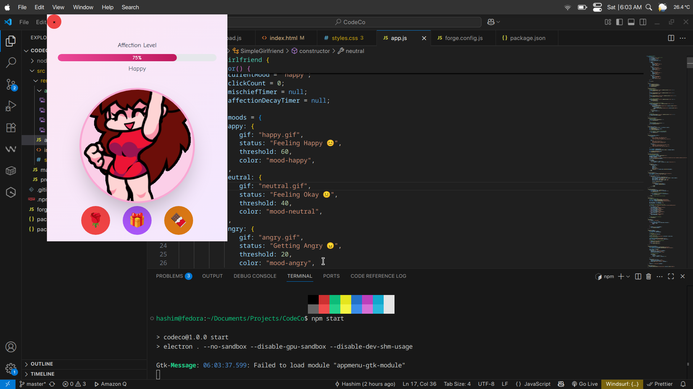
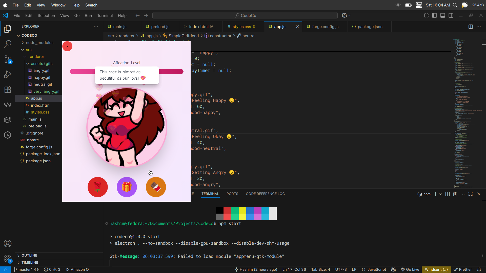
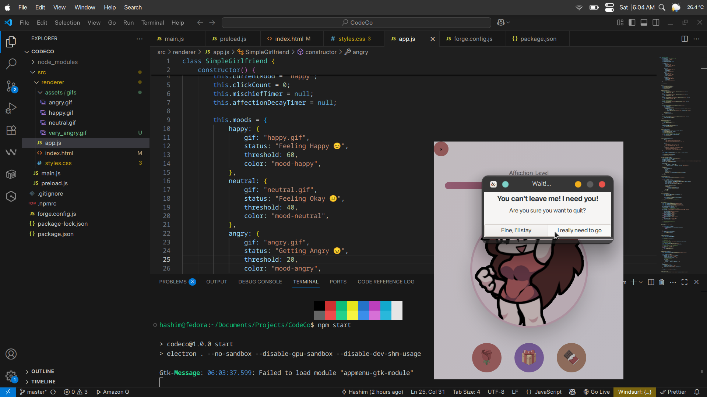

# CodeCo 💕

## Basic Details

### Team Name: Solo Dev Squad

### Team Members

- Team Lead: Hashim - Model Engineering College

### Project Description

A wild and unhinged virtual girlfriend simulator built with Electron that brings digital companionship to your desktop with questionable life choices.

### The Problem (that doesn't exist)

People are getting too much real human interaction and need a way to practice awkward conversations with an AI that judges their life decisions.

### The Solution (that nobody asked for)

We've created a desktop application that simulates having a virtual girlfriend who's probably more dramatic than any real relationship you've ever had!

## Technical Details

### Technologies/Components Used

For Software:

- JavaScript (ES6+)
- Electron Framework
- HTML5 & CSS3
- Node.js
- Chokidar (File watching)
- Node-notifier (Desktop notifications)

### Implementation

For Software:

# Installation

```bash
npm install
```

# Run

```bash
# Development mode
npm run dev

# Production mode
npm start

# Build package
npm run package
```

### Project Documentation

For Software:

# Screenshots


_Main application interface showing the virtual girlfriend simulator in action_


_Interactive chat interface where users can have conversations with their virtual companion_


_Desktop integration features including notifications and system tray functionality_

### Project Demo

# Video


_Full Working Demo Video_

## Team Contributions

- Hashim: Full-stack development, UI/UX design, Electron configuration, and questionable life decisions that led to this project

---

Made with ❤️ at TinkerHub Useless Projects


